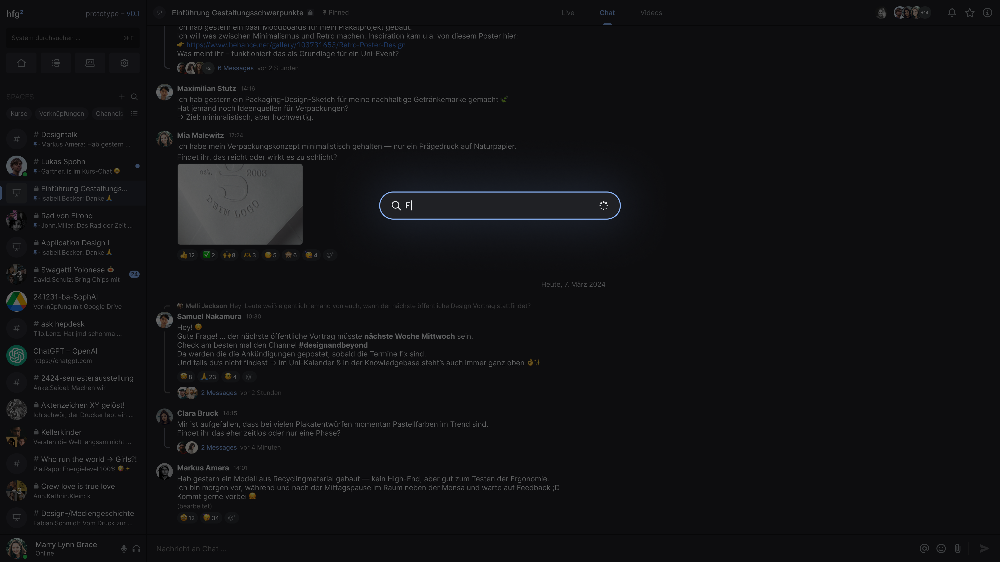
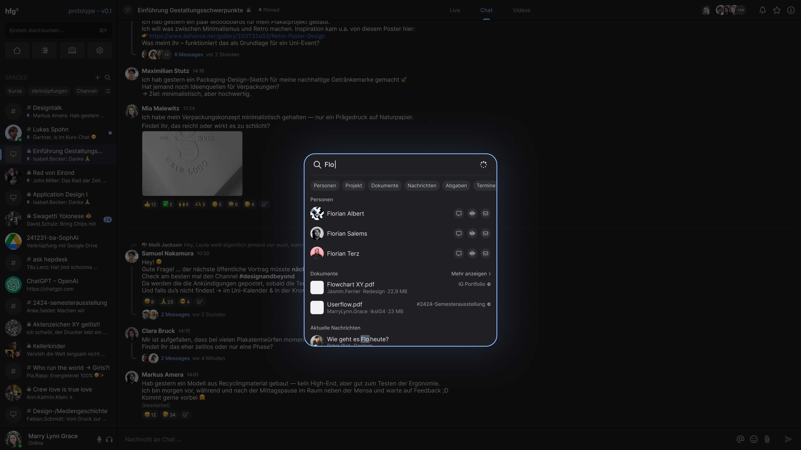

# Navigation

## Sidebar

Die Sidebar bildet das zentrale Bedienelement der Plattform. Sie ermöglicht den Zugriff auf globale Funktionen wie **Suche, Startseite, Spaces** und **Nutzereinstellungen**.
Die Navigation ist dauerhaft sichtbar und in zwei Zuständen nutzbar: **eingeklappt** und **ausgeklappt**.

Im **eingeklappten Zustand** werden nur die Hauptfunktionen als Icons angezeigt – etwa Suche, Home, Knowledge Base und die Space-Liste.

Im **ausgeklappten Zustand** werden zu den Icons ergänzende Beschriftungen, Space-Namen und Filteroptionen angezeigt. Außerdem erscheint unter dem eigenen Profilbild der vollständige Name, der Online-Status sowie der Voice-Chat und die Einstellungen.

## Suche

Die globale Suche ermöglicht es, schnell und kontextübergreifend Inhalte auf der Plattform zu finden. Sie durchsucht **Spaces, Nachrichten, Personen, Dateien, Bilder** sowie **Archivprojekte** aus dem [HfG-Archiv](https://archiv.hfg.design).
Die Suche ist **global**, sie durchsucht also alle Inhalte unabhängig vom aktuellen Kontext oder Space. Eine **lokale Space-Suche** ist auch vorgesehen.

Suchvorschläge werden während der Eingabe automatisch angezeigt. Suchergebnisse sind nach Typ gruppiert, wodurch sich relevante Inhalte effizient filtern und öffnen lassen.

## Home

Führt zum [Dashboard](dashboard).

## Curriculum

Der Bereich **Curriculum** ist noch nicht implementiert.

## Knowledge Base

Der Bereich **Knowledge Base** ist noch nicht implementiert.
